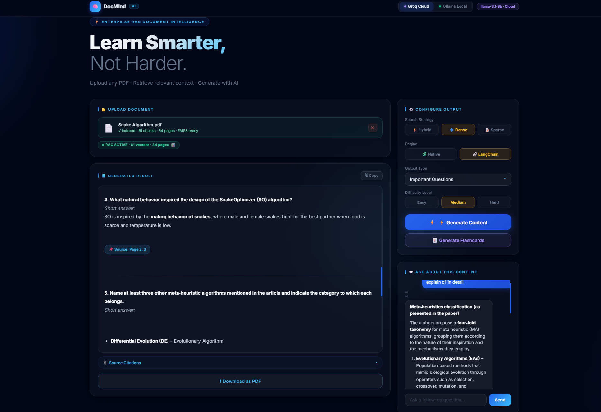
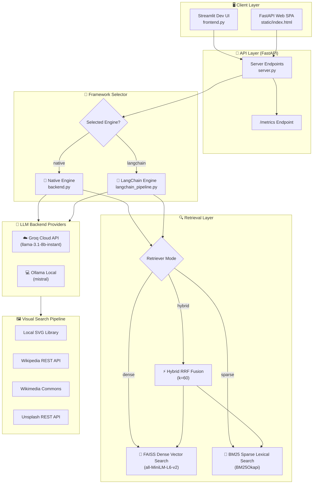

# 🧠 DocMind AI — RAG Documentation & Architecture Guide


> **DocMind AI** is an enterprise-grade RAG-powered document intelligence platform with configurable search strategies (Hybrid, Dense, Sparse), dual execution engines (Native Python vs. LangChain), page-level citations, multi-tiered visual diagram discovery, dual LLM backends (Groq Cloud & Ollama Local), and real-time pipeline telemetry.

---

## 📑 Table of Contents

1. [Executive Summary](#-executive-summary)
2. [Application Interface & Working Preview](#-application-interface--working-preview)
3. [Why We Have Output Configuration (⚙️ Configure Output)](#-why-we-have-output-configuration--configure-output)
   - [Output Types Explained](#output-types-explained)
   - [Difficulty Levels Explained](#difficulty-levels-explained)
3. [Deep-Dive: Search Strategies (Search Strategy)](#-deep-dive-search-strategies-search-strategy)
   - [⚡ Hybrid Search (Recommended)](#-hybrid-search-recommended)
   - [🔷 Dense Vector Search](#-dense-vector-search)
   - [📝 Sparse Lexical Search](#-sparse-lexical-search)
   - [Comparative Analysis Matrix](#comparative-analysis-matrix-search-strategies)
4. [Deep-Dive: Framework Engines (Engine)](#-deep-dive-framework-engines-engine)
   - [🐍 Native Python Engine](#-native-python-engine)
   - [🔗 LangChain Engine](#-langchain-engine)
   - [Comparative Analysis Matrix](#comparative-analysis-matrix-framework-engines)
5. [System Architecture & Working Mechanism](#-system-architecture--working-mechanism)
   - [High-Level Architecture Flowchart](#high-level-architecture-flowchart)
   - [RAG Processing Pipeline Sequence](#rag-processing-pipeline-sequence)
   - [Ingestion, Chunking & Lineage Tracking](#ingestion-chunking--lineage-tracking)
   - [Page-Level Citation Pipeline](#page-level-citation-pipeline)
   - [Multi-Tiered Visual Search Engine](#multi-tiered-visual-search-engine)
   - [Telemetry & Analytics Engine](#telemetry--analytics-engine)
6. [Dual LLM Backends](#-dual-llm-backends)
7. [Directory & Project Structure](#-directory--project-structure)
8. [📡 API Endpoint Reference](#-api-endpoint-reference)
9. [🚀 Quickstart & Setup Guide](#-quickstart--setup-guide)
10. [📄 License](#-license)

---

## 📌 Executive Summary

**DocMind AI** is a modular Retrieval-Augmented Generation (RAG) platform designed to transform complex academic literature, lecture slides, and textbooks into structured, highly readable study materials. 

---

## 📸 Application Interface & Working Preview



---

## ⚙️ Why We Have Output Configuration (`⚙️ Configure Output`)

In academic learning, different study tasks require different cognitive formats and levels of depth:
- Learning a new concept requires a broad overview (**Summary**).
- Preparing for written exams requires structured analytical problems (**Important Questions**).
- Preparing for oral defenses requires rapid-fire core concept validation (**Viva Questions**).
- Quick self-testing requires structured evaluation (**MCQs** & **Flashcards**).

The `⚙️ Configure Output` sidebar section allows users to precisely configure the study material generated from their uploaded PDF.

```
⚙️ Configure Output
├── Search Strategy : ⚡ Hybrid | 🔷 Dense | 📝 Sparse
├── Engine          : 🐍 Native | 🔗 LangChain
├── Output Type     : Summary | Important Questions | Viva Questions | MCQs
└── Difficulty Level: Easy | Medium | Hard
```

### Output Types Explained

| Output Type | Purpose & Cognitive Goal | Generated Format |
| :--- | :--- | :--- |
| 📝 **Summary** | Concept Compression & Overview | Structured hierarchical Markdown with major section headers, bold key terms, and bullet points. Ideal for initial reading. |
| ❓ **Important Questions** | Written Exam & Theory Prep | 7 analytical, high-yield exam questions accompanied by comprehensive model answers referencing PDF context. |
| 🗣️ **Viva Questions** | Oral Examination & Interview Prep | 7 sharp, conceptual oral examination questions with compact, precise answer keys for quick verbal recall. |
| 🔘 **MCQs** | Objective Self-Testing | 7 multiple-choice questions with 4 distinct options (A–D), clearly marked correct answers, and conceptual distractors. |
| 🃏 **Flashcards** | Active Recall & Spaced Repetition | Interactive 3D flip card deck (Question on front, Answer on back) generated via dedicated RAG extraction. |
| 📄 **PDF Export** | Offline Study & Printables | Styled, downloadable PDF documents generated on-the-fly using `ReportLab` with formatted headers, borders, and typography. |

### Difficulty Levels Explained

- **🟢 Easy**: Focuses on foundational definitions, core terminology, and basic conceptual explanations. Suitable for introductory study.
- **🟡 Medium** *(Default)*: Balances core principles with analytical applications, comparative reasoning, and functional relationships.
- **🔴 Hard**: Emphasizes advanced theoretical mechanisms, edge cases, mathematical formulation, and deep multi-concept synthesis.

---

## 🔍 Deep-Dive: Search Strategies (`Search Strategy`)

Retrieval is the core foundation of any RAG pipeline. Different queries require different retrieval mechanics. A single vector search method is rarely optimal across all technical document queries.

The platform provides three configurable retrieval strategies:

```
Search Strategy Selection
│
├── ⚡ Hybrid (BM25 Lexical + FAISS Dense Vector Fused via Reciprocal Rank Fusion)
├── 🔷 Dense  (FAISS Dense Vector Search via sentence-transformers)
└── 📝 Sparse (BM25Okapi Lexical Keyword Search)
```

---

### ⚡ Hybrid Search (Recommended)

#### What It Is
Hybrid search runs **BM25 Lexical Keyword Search** and **FAISS Dense Vector Search** simultaneously in parallel. It then combines their separate ranking lists into a unified, optimal rank using **Reciprocal Rank Fusion (RRF)**.

#### Mathematical Foundation: Reciprocal Rank Fusion (RRF)
Given a set of candidate document chunks $D$ retrieved from different algorithms $m \in M$ (where $M = \{\text{Dense}, \text{Sparse}\}$), the RRF score for document chunk $d$ is calculated as:

$$\text{RRF\_Score}(d) = \sum_{m \in M} \frac{1}{k + r_m(d)}$$

Where:
- $r_m(d)$ is the 1-based ordinal rank position of document $d$ in retrieval method $m$.
- $k$ is an empirical smoothing constant set to **60** (following the foundational research by Cormack et al.).

#### Why We Use It
- **Combines Best of Both Worlds**: Solves the vocabulary mismatch problem of sparse search while preserving exact keyword matching that dense models often blur.
- **Handles Technical Documents**: Academic papers contain both high-level semantic ideas (ideal for dense vectors) and precise formulas, proper names, or acronyms (ideal for sparse lexical matching).

#### When to Use
- **Default & Recommended for all general study tasks.**
- When documents contain a mix of domain-specific jargon, math expressions, and descriptive narrative text.

---

### 🔷 Dense Vector Search

#### What It Is
Dense search embeds the query and document chunks into a continuous high-dimensional vector space using a deep neural network encoder (`sentence-transformers/all-MiniLM-L6-v2`). Retrieval is performed by calculating the **Cosine Similarity / Inner Product** between the query vector and chunk vectors stored in a **FAISS** index (`faiss.IndexFlatIP`).

#### Mathematical Foundation
Each chunk text $T_i$ is mapped to a 384-dimensional $L_2$-normalized dense vector $\vec{v}_i \in \mathbb{R}^{384}$, where $\|\vec{v}_i\|_2 = 1$.
The query $Q$ is similarly mapped to $\vec{q} \in \mathbb{R}^{384}$. The similarity score is computed as:

$$\text{Sim}(Q, T_i) = \vec{q} \cdot \vec{v}_i = \sum_{j=1}^{384} q_j \cdot v_{i,j}$$

#### Why We Use It
- **Semantic Understanding**: Finds relevant text even when different vocabulary or synonyms are used (e.g., matching "artificial intelligence" with "machine learning" or "gradient descent" with "optimization algorithm").
- **Paraphrase Resilient**: Understands conceptual queries that do not match exact wording.

#### When to Use
- Conceptual questions ("Explain how neural networks learn").
- When the query uses informal or paraphrased language.

#### Limitations
- Can suffer from "vocabulary dilution" where specific alphanumeric codes, variable names, or rare terminology get missed because the embedding model projects them to nearby general concepts.

---

### 📝 Sparse Lexical Search

#### What It Is
Sparse search uses the **BM25Okapi** algorithm (an advanced variant of TF-IDF). It scores document chunks based on exact term frequencies, document lengths, and inverse document frequencies across lowercased tokenized words.

#### Mathematical Foundation
For query terms $q_1, q_2, \dots, q_n$, the BM25 score for chunk $D$ is computed as:

$$\text{Score}_{\text{BM25}}(D, Q) = \sum_{i=1}^{n} \text{IDF}(q_i) \cdot \frac{f(q_i, D) \cdot (k_1 + 1)}{f(q_i, D) + k_1 \cdot \left(1 - b + b \cdot \frac{|D|}{\text{avgdl}}\right)}$$

Where:
- $f(q_i, D)$ is the term frequency of $q_i$ in chunk $D$.
- $|D|$ is the word count of chunk $D$, and $\text{avgdl}$ is the average chunk length across the document.
- $k_1 = 1.5$ and $b = 0.75$ are default tuning parameters.

#### Why We Use It
- **Exact Keyword Precision**: Guarantees finding exact literal text strings, unique identifiers, code snippets, formula symbols, or author names.
- **Fast Execution**: Extremely fast in-memory term frequency table lookup.

#### When to Use
- Searching for specific numbers, table values, proper nouns, model acronyms (e.g., "ResNet-50", "Algorithm 3", "Equation 4.1").

#### Limitations
- Completely blind to synonyms or semantic context. If the user asks about "learning rate decay" and the PDF uses "step-down learning schedule", BM25 will score 0.

---

### Comparative Analysis Matrix: Search Strategies

| Criteria | ⚡ Hybrid Search | 🔷 Dense Search | 📝 Sparse Search |
| :--- | :--- | :--- | :--- |
| **Primary Algorithm** | Reciprocal Rank Fusion ($k=60$) | FAISS `IndexFlatIP` (Cosine) | BM25Okapi (Lexical TF-IDF) |
| **Representation** | Combined Rank Space | 384-dim Dense Embeddings | Token Frequency Inverted Index |
| **Exact Word Match** | ⭐⭐⭐⭐⭐ (Excellent) | ⭐⭐ (Moderate) | ⭐⭐⭐⭐⭐ (Perfect) |
| **Semantic Match** | ⭐⭐⭐⭐⭐ (Excellent) | ⭐⭐⭐⭐⭐ (Perfect) | ⭐ (Poor) |
| **Synonym Handling** | ⭐⭐⭐⭐⭐ (Excellent) | ⭐⭐⭐⭐⭐ (Perfect) | ❌ (None) |
| **Query Speed** | ~10–15 ms | ~8–12 ms | ~1–3 ms |
| **Best For** | General study, technical textbooks | Conceptual questions, ideas | Acronyms, equations, specific terms |
| **Failure Mode** | None (balanced) | Misses exact rare symbols | Fails on rephrased queries |

---

## 🏗️ Deep-Dive: Framework Engines (`Engine`)

To demonstrate software engineering elegance and provide architectural flexibility, the system implements a **Strategy Pattern** allowing runtime selection between two backend execution engines:

```
Framework Selection
│
├── 🐍 Native Engine    (Custom pure Python / NumPy / FAISS / BM25 implementation)
└── 🔗 LangChain Engine (LangChain 0.3 abstractions & ecosystem integrations)
```

Both engines implement an identical public interface:
- `prepare_document(file_bytes, file_name)`
- `retrieve_chunks(query, document, top_k, retriever_mode)`
- `generate_content(choice, difficulty, backend, document, retriever_mode)`
- `answer_question(question, backend, document, generated_output, retriever_mode)`
- `generate_flashcards(count, difficulty, backend, document, retriever_mode)`

---

### 🐍 Native Python Engine (`backend.py`)

#### Design Rationale
The Native Engine is a light, transparent, production-grade RAG pipeline built directly with core Python libraries (`PyPDF2`, `SentenceTransformer`, `faiss-cpu`, `rank-bm25`, `requests`, `numpy`, `pandas`).

#### Key Characteristics
1. **Word-Based Sliding Window Chunking**: Splits text into chunks of exactly `220 words` with `40 words` of overlap (step size of 180 words).
2. **Direct FAISS & BM25 Control**: Manages the `faiss.IndexFlatIP` and `BM25Okapi` indices directly in memory without additional wrapper layers.
3. **Low Latency & Minimal Memory Overhead**: Eliminates object translation overhead inherent in larger orchestration frameworks.
4. **Custom Prompt Injection**: Directly injects page lineage markers `[Page X]` into context blocks before passing to Groq or Ollama REST APIs.

---

### 🔗 LangChain Engine (`langchain_pipeline.py`)

#### Design Rationale
The LangChain Engine reimplements the pipeline using standard abstractions from the **LangChain 0.3** ecosystem (`RecursiveCharacterTextSplitter`, `LangChainFAISS`, `HuggingFaceEmbeddings`, `ChatGroq`, `ChatOllama`).

#### Key Characteristics
1. **Character-Based Recursive Chunking**: Uses `RecursiveCharacterTextSplitter` with `chunk_size=1100` characters (~220 words) and `chunk_overlap=200` characters, splitting hierarchically on `\n\n`, `\n`, space, and empty string.
2. **LangChain VectorStore Wrappers**: Utilizes `langchain_community.vectorstores.FAISS` for vector indexing and `similarity_search_with_score()`.
3. **Ecosystem Standardization**: Allows easy swap-in of alternate vectorstores (e.g., Chroma, Qdrant, Pinecone) or document loaders from the LangChain registry.

---

### Comparative Analysis Matrix: Framework Engines

| Criteria | 🐍 Native Python Engine (`backend.py`) | 🔗 LangChain Engine (`langchain_pipeline.py`) |
| :--- | :--- | :--- |
| **Underlying Tech** | Direct NumPy, FAISS, PyPDF2, BM25Okapi | LangChain 0.3 ecosystem packages |
| **Chunking Logic** | Sliding word window (220 words, 40 overlap) | `RecursiveCharacterTextSplitter` (1100 chars, 200 overlap) |
| **Vector Store** | `faiss.IndexFlatIP` (Native C++ bindings) | `langchain_community.vectorstores.FAISS` |
| **LLM Interface** | Native HTTP API calls (`groq` SDK / `requests`) | `ChatGroq` / `ChatOllama` abstractions |
| **Overhead** | Minimal (~0ms added overhead) | Framework abstraction layer (~2-5ms) |
| **Extensibility** | Manual implementation required | Pluggable with 100+ LangChain integrations |
| **Primary Use Case**| Maximum performance, tight memory budget | Rapid integration with enterprise AI stack |

---

## 🏗️ System Architecture & Working Mechanism

### High-Level Architecture Flowchart



---

### RAG Processing Pipeline Sequence

```mermaid
sequenceDiagram
    autonumber
    actor User as 👤 User
    participant FE as 🖥️ Frontend (SPA / Streamlit)
    participant API as ⚡ FastAPI Server
    participant Engine as ⚙️ RAG Engine (Native / LangChain)
    participant Index as 🔍 Index Store (FAISS + BM25)
    participant LLM as 🤖 LLM Provider (Groq / Ollama)
    participant Visual as 🖼️ Visual Pipeline

    %% Document Ingestion
    rect rgb(15, 23, 42)
        note over User, Index: Phase 1: PDF Document Ingestion & Indexing
        User->>FE: Upload PDF document
        FE->>API: POST /upload (multipart file)
        API->>Engine: prepare_document(file_bytes)
        Engine->>Engine: PyPDF2 text extraction with 1-indexed page numbers
        Engine->>Engine: Chunk text with page lineage mapping
        Engine->>Engine: Compute embeddings (all-MiniLM-L6-v2)
        Engine->>Index: Build FAISS IndexFlatIP & BM25Okapi index
        Index-->>Engine: Index built successfully
        Engine-->>API: Document Session Created {session_id, page_count, chunk_count}
        API-->>FE: Return session metadata & activate UI
    end

    %% Execution Phase
    rect rgb(30, 41, 59)
        note over User, Visual: Phase 2: Retrieval, Generation & Citation
        User->>FE: Ask question or click Generate
        FE->>API: POST /chat or POST /generate (session_id, retriever_mode, framework)
        API->>Engine: retrieve_chunks(query, retriever_mode)
        alt Hybrid Mode
            Engine->>Index: Query FAISS dense vector search
            Engine->>Index: Query BM25 sparse lexical search
            Index-->>Engine: Dense & Sparse Candidate Rankings
            Engine->>Engine: Execute Reciprocal Rank Fusion (k=60)
        else Dense Mode
            Engine->>Index: Query FAISS dense vector search
        else Sparse Mode
            Engine->>Index: Query BM25 sparse lexical search
        end
        Engine->>Engine: Format context with [Page X] markers & citation rules
        Engine->>LLM: Send augmented prompt to Groq / Ollama
        LLM-->>Engine: Response content + VISUAL_HINT:<topic>
        Engine->>Engine: Extract citations & format citation pills
        Engine->>Visual: Trigger collect_visuals(visual_hint)
        Visual->>Visual: Parallel execution: Local SVG -> Wikipedia REST -> Commons -> Unsplash
        Visual-->>Engine: Matched visual diagram artifact
        Engine-->>API: JSON payload {content, citations, visuals}
        API-->>FE: Render formatted output with citations & diagram cards
        FE-->>User: Display answer, citation pills & visual diagram
    end
```



---

### Ingestion, Chunking & Lineage Tracking

1. **PDF Text Extraction**: `extract_text_from_pdf()` processes PDFs using `PyPDF2`, maintaining page boundaries and returning structured page dictionary objects `{"page": 1, "text": "..."}`.
2. **Word-Page Boundary Mapping**: `chunk_text()` builds `(word, page_number)` tuples. As sliding windows step through words, each chunk aggregates all unique pages it spans into a `pages: list[int]` field.
3. **Embeddings**: `create_embeddings()` uses `sentence-transformers/all-MiniLM-L6-v2` to produce 384-dimensional $L_2$-normalized float32 vectors.
4. **Dual Indexing**: Embeddings are loaded into `faiss.IndexFlatIP`, while tokenized chunk texts are loaded into `BM25Okapi`.

---

### Page-Level Citation Pipeline

To eliminate hallucination and guarantee academic verifiability, every retrieved chunk retains its original PDF page lineage:

```
PDF Document (Page 12) ──► Chunk #42 [pages: [12]] ──► Context: "[Page 12]: Text..." ──► Prompt Instruction ──► Output: "... [Source: Page 12]"
```

System prompt injection forces the LLM to include explicitly formatted `[Source: Page X]` tags. The frontend parses these tags into interactive citation pills that display chunk confidence scores and text previews on hover.

---

### Multi-Tiered Visual Search Engine

When answering questions, the system asks the LLM to emit a `VISUAL_HINT: <exact_topic_name>`. The `collect_visuals()` module processes this hint using a 3-tier fallback hierarchy:

```
VISUAL_HINT Extraction
│
├── Tier 1: Local Curated SVG Diagrams (rnn.svg, cnn.svg, transformer.svg) [Instant]
│
├── Tier 2: Concurrent Web Search via ThreadPoolExecutor (max_workers=2)
│   ├── Wikipedia REST Summary API (Primary article thumbnail)
│   └── Wikimedia Commons API (Search File: namespace for diagrams/flowcharts)
│
└── Tier 3: Unsplash REST API Fallback (Landscape high-resolution educational photos)
```

---

### Telemetry & Analytics Engine

Every retrieval and generation operation logs performance telemetry to a thread-safe rolling queue (`collections.deque` with `threading.Lock`, max 200 entries).

The `/metrics/{session_id}` endpoint uses **Pandas** to compute real-time statistical aggregations:
- **Latency Breakdown**: Mean, median, p95, min, max for embedding time, retrieval time, LLM inference time, and total end-to-end execution time.
- **Similarity Distributions**: Mean, max, min cosine similarity scores for retrieved chunks.
- **Token Analytics**: Prompt and completion token counts per request.
- **Breakdown Distributions**: Usage counts split across retriever modes (`hybrid`, `dense`, `sparse`) and operations (`generate`, `chat`).

---

## 🤖 Dual LLM Backends

Users can toggle seamlessly between two LLM execution environments at runtime:

### 1. ☁️ Groq Cloud API (`Groq (Cloud)`)
- **Default Model**: `llama-3.1-8b-instant` (configurable via `GROQ_MODEL` environment variable).
- **Features**: Ultra-fast cloud inference (~300–800 tokens/sec), low latency, zero local GPU/CPU load.
- **Requirement**: `GROQ_API_KEY` configured in `.env`.

### 2. 💻 Ollama Local (`Ollama (Local)`)
- **Default Model**: `mistral`.
- **Features**: Privacy-focused 100% local inference, zero data transmitted to third-party servers, works offline.
- **Endpoint**: `http://localhost:11434/api/chat`.
- **Requirement**: Ollama installed and running locally (`ollama serve`).

---

## 📁 Directory & Project Structure

```
AI_STUDY_ASSISTANT/
├── app.py                  # Production entry point (launches FastAPI server via Uvicorn)
├── backend.py              # Core Native RAG engine, vector indexing, retrieval, visual search, telemetry
├── langchain_pipeline.py   # LangChain 0.3 RAG engine implementation (Strategy Pattern)
├── server.py               # FastAPI REST API server & static file router
├── frontend.py             # Optional Streamlit development UI
├── requirements.txt        # Pinned Python package dependencies
├── .env.example            # Environment variables configuration template
├── .env                    # Environment API keys (git-ignored)
├── README.md               # Project documentation & architecture guide
├── static/
│   ├── index.html          # Web SPA markup with glassmorphism UI layout
│   ├── app.js              # Client-side JavaScript SPA controller logic
│   └── style.css           # Custom Glassmorphism CSS design system
└── assets/
    └── diagrams/           # Curated local SVG diagram library
        ├── rnn.svg         # Recurrent Neural Network architecture diagram
        ├── cnn.svg         # Convolutional Neural Network architecture diagram
        └── transformer.svg # Transformer / Self-Attention architecture diagram
```

---

## 📡 API Endpoint Reference

### Summary of REST Endpoints

| Method | Endpoint | Form Parameters / Query | Description |
| :--- | :--- | :--- | :--- |
| `POST` | `/upload` | `file` (PDF File) | Ingests PDF, chunks text, creates embeddings, builds FAISS + BM25 indices. |
| `POST` | `/generate` | `session_id`, `choice`, `difficulty`, `backend`, `retriever_mode`, `framework` | Generates structured study content (Summary, Questions, MCQs) with citations. |
| `POST` | `/chat` | `session_id`, `question`, `backend`, `generated_output`, `retriever_mode`, `framework` | Answers user questions with RAG context, citations, and visual diagrams. |
| `POST` | `/flashcards`| `session_id`, `count`, `difficulty`, `backend`, `retriever_mode`, `framework` | Generates Q&A flashcards deck for active recall. |
| `POST` | `/download` | `text`, `output_type` | Converts Markdown text into a styled printable PDF document (`ReportLab`). |
| `GET` | `/metrics/{session_id}` | — | Returns Pandas-aggregated latency, token, and score telemetry stats. |

---

## 🚀 Quickstart & Setup Guide

### Prerequisites
- **Python 3.10+** installed.
- (Optional) **Ollama** installed if running local inference (`ollama pull mistral`).
- A **Groq API Key** (get one free at [console.groq.com](https://console.groq.com)).

### Step 1: Clone & Navigate

```bash
git clone https://github.com/your-username/AI_STUDY_ASSISTANT.git
cd AI_STUDY_ASSISTANT
```

### Step 2: Set Up Virtual Environment

```bash
# Linux / macOS
python3 -m venv venv
source venv/bin/activate

# Windows (PowerShell)
python -m venv venv
venv\Scripts\Activate.ps1
```

### Step 3: Install Dependencies

```bash
pip install -r requirements.txt
```

### Step 4: Configure Environment Variables

Create a `.env` file in the root directory (or copy `.env.example`):

```bash
cp .env.example .env
```

Edit `.env` and add your Groq API key:

```env
GROQ_API_KEY=gsk_your_actual_groq_api_key_here
GROQ_MODEL=llama-3.1-8b-instant
UNSPLASH_ACCESS_KEY=optional_unsplash_access_key_here
```

### Step 5: Launch the Application

#### Production Web SPA (Recommended)
Run the FastAPI production application:

```bash
python app.py
```

- Access the modern Web SPA interface at **`http://127.0.0.1:8000`**
- Interactive Swagger API documentation is available at **`http://127.0.0.1:8000/docs`**

#### Optional Streamlit Development UI
To run the Streamlit interface for quick dev testing:

```bash
streamlit run frontend.py
```

---

## 📄 License

This project is licensed under the **MIT License**. Feel free to modify and adapt it for educational and research purposes.
